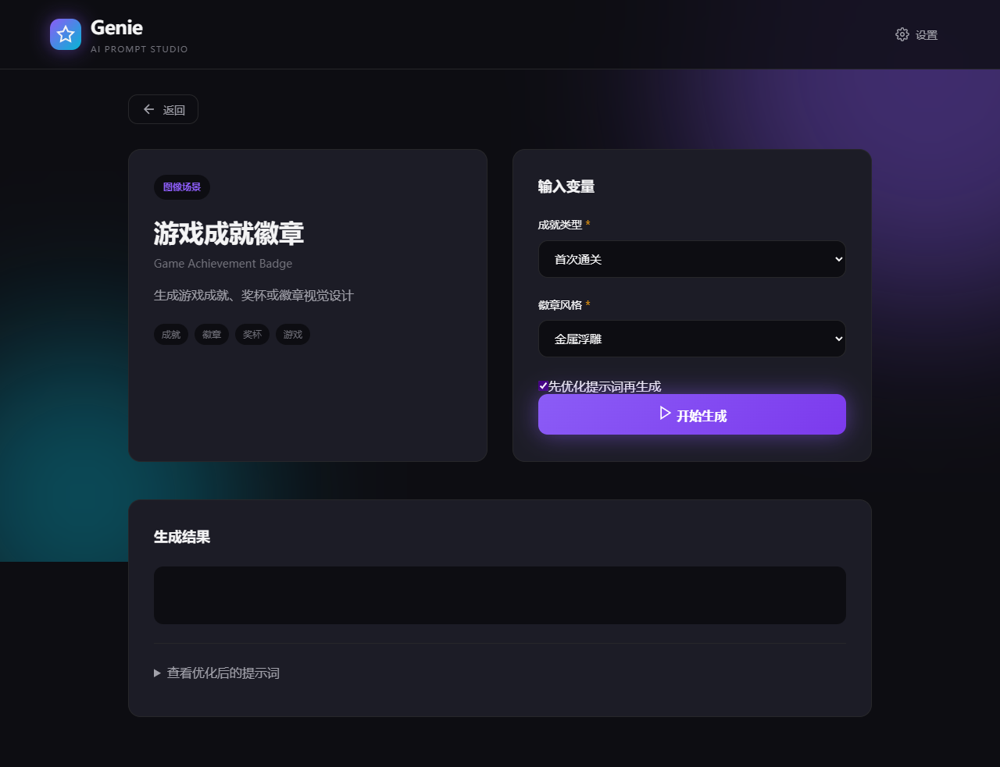
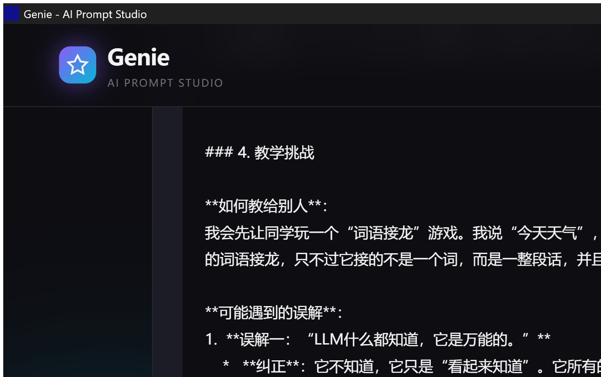

# Genie

一个基于 Tauri + Vue 3 的 AI 提示词工作台，用来整理可复用场景、填写变量并直接生成结果。项目面向桌面端，兼顾本地配置体验和真实 LLM 调用流程。


## 项目简介

Genie 把常见 AI 使用场景整理成可直接运行的卡片式目录。你可以先浏览和筛选场景，再进入详情页填写变量，选择是否启用提示词优化，最后直接生成内容并查看格式化结果或原始提示词。

当前项目已经包含场景目录、Prompt 模板填充、真实模型调用、Markdown 渲染和本地 API Key 存储等完整链路，适合作为桌面 AI 工具原型或二次开发基础。

## 功能亮点

- 场景列表浏览，支持按类型、分类和关键词筛选
- 场景详情页变量输入，校验必填项后再执行
- 支持文本与图像两类场景
- 支持 OpenAI、DeepSeek、Grok 三类提供方的 API Key
- 可选提示词优化流程，先优化再调用模型
- 生成结果支持 Markdown 渲染和原始内容切换查看
- Tauri 本地存储 API Key，桌面端使用体验更完整
- 对未接入 Prompt 模板的场景保留 mock 回退能力

## 界面预览

### 场景详情页



### 桌面应用窗口



## 技术栈

- 桌面框架：Tauri 2
- 前端：Vue 3 + Vite
- 状态与交互：Composition API
- LLM 接入：OpenAI SDK
- Markdown 渲染：`markdown-it` + `DOMPurify` + `KaTeX`
- 测试：Vitest + Vue Test Utils
- 原生侧：Rust

## 快速开始

### 环境要求

- Node.js 18+
- Rust / Cargo

### 安装依赖

```bash
npm install
```

### 启动开发环境

```bash
npm run tauri:dev
```

### 运行测试

```bash
npm test
```

### 构建桌面应用

```bash
npm run tauri:build
```

## 项目结构

```text
genie/
├─ src/
│  ├─ components/        # 通用界面组件
│  ├─ scenes/            # 场景目录、Prompt 模板与分类数据
│  ├─ views/             # 场景列表、详情页、设置页
│  ├─ api.ts             # 场景执行入口与结果格式化
│  ├─ llm-service.ts     # LLM 请求封装
│  ├─ markdown.ts        # Markdown 渲染与安全处理
│  ├─ prompt-optimizer.ts
│  ├─ tauri-api.ts       # Tauri invoke 封装
│  └─ types.ts
├─ src-tauri/            # Tauri / Rust 原生侧
├─ docs/                 # 场景设计文档
└─ README.md
```

## 使用说明

1. 启动应用后进入场景列表页。
2. 通过类型、分类或搜索快速定位场景。
3. 打开场景详情页，填写变量。
4. 在设置页保存 API Key。
5. 选择是否启用提示词优化后执行生成。
6. 在结果区查看渲染后的内容，或切换查看原始提示词与优化结果。

## 当前仓库特点

- 仓库中同时包含前端界面、场景数据和原生 Tauri 集成
- 已具备从 Prompt 模板到模型调用再到结果展示的完整闭环
- 适合继续扩展更多场景、模型选择、导出能力和本地工作流

## 后续计划

- 增加更多高质量场景模板
- 补充模型与参数选择能力
- 增加历史记录、收藏和导出
- 完善桌面端打包与发布流程
